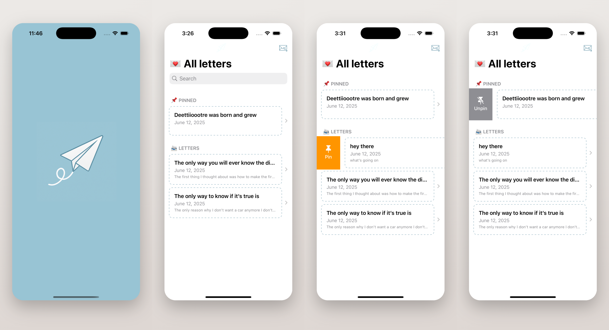

# Letterlogue

A journaling app built with SwiftUI that let users write personal letters to themselves, using SwiftData for data storage.

## Features
- Write and manage letters: create, browse, edit, and delete letters.
- Pin, or unpin letters.

## Technologies
- SwiftUI 5
- SwiftData
